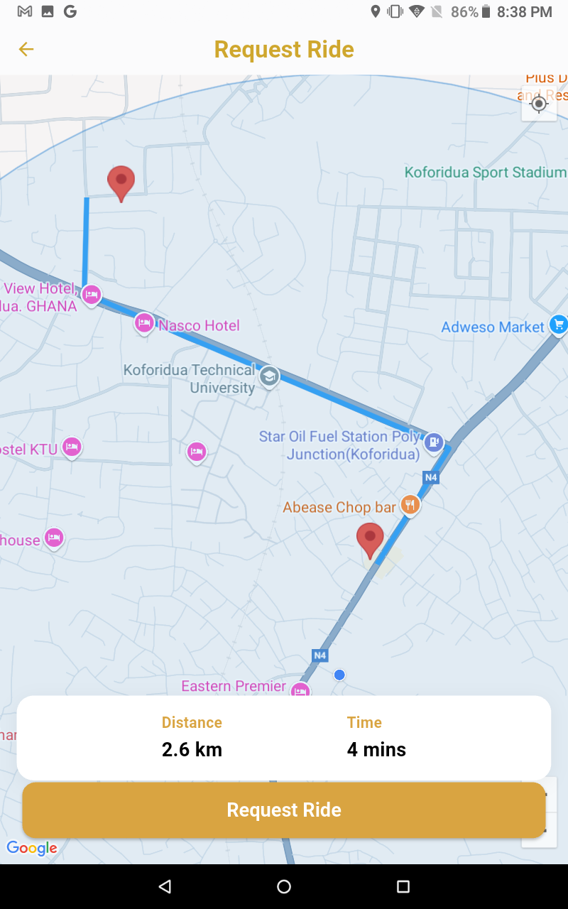
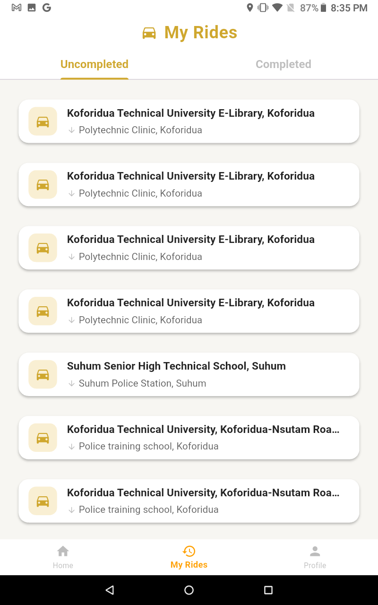
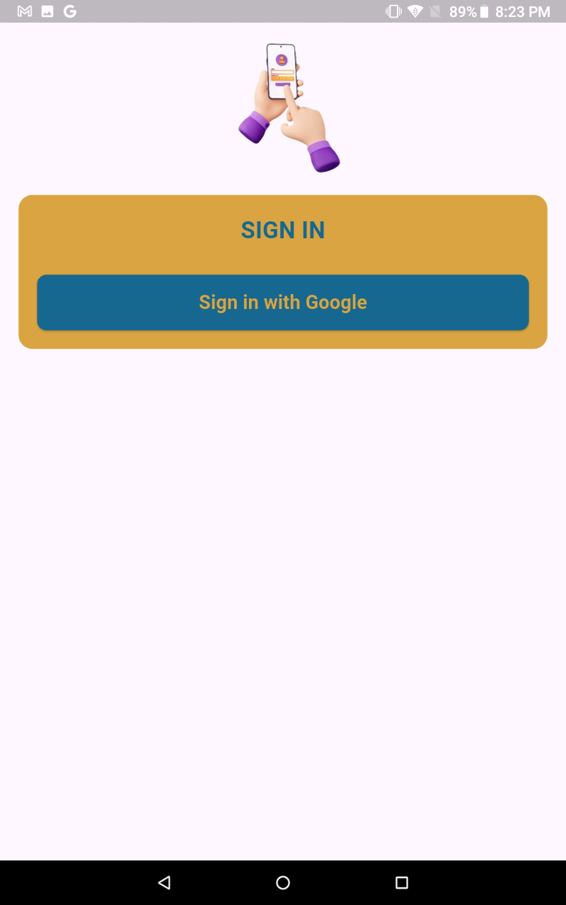

# 🚖 KP Ride — Ride-Hailing Platform (Bolt-like)

A complete **ride-hailing system** built with Flutter and Supabase, featuring:
- **Rider App** – For customers to book rides
- **Driver App** – For drivers to accept and complete trips
- **Admin Dashboard** – For managing rides, drivers, and users

This is a showcase repository containing cleaned versions of all apps **(no API keys)** and screenshots.

---

## 📱 Rider App
The Rider app allows users to:
- Sign in using Google
- View their current location on **Google Maps**
- Search destinations with **Google Places**
- View available drivers in real-time
- Request a ride & track driver arrival
- View ride history

### Screenshots
| Loading Screen | Login | Home | Request Ride |
|---------------|-------|------|--------------|
|  |  |  |  |

| Looking for Driver | Pickup & Dropoff | My Rides 1 | My Rides 2 |
|--------------------|------------------|------------|------------|
|  |  |  |  |

| Profile | About |
|---------|-------|
|  |  |

---

## 🚗 Driver App
The Driver app allows drivers to:
- Sign in using Google
- Go online/offline
- View ride requests in real-time
- Accept or reject rides
- Get navigation assistance via Google Maps
- Mark rides as completed

### Screenshots
| Login | Offline Homepage | Online Homepage | Ride Request |
|-------|------------------|-----------------|--------------|
|  |  |  |  |

| My Rides 1 | My Rides 2 | Earnings | Support |
|------------|-----------|----------|---------|
|  |  |  |  |

---

## 🖥️ Admin Dashboard
The web-based dashboard allows admins to:
- View all registered riders & drivers
- Track ongoing rides in real-time
- Manage user accounts
- View ride history and statistics
- Respond to feedback

### Screenshots
| Login | Main Dashboard | Drivers |
|-------|----------------|---------|
|  |  |  |

| Rides | Earnings | Feedback Response |
|-------|----------|-------------------|
|  |  |  |

---

## 🛠 Tech Stack
**Frontend (All Apps)**
- Flutter (Dart)
- Google Maps API
- Google Places API
- Supabase (Auth, DB, Realtime)
- Go Router
- Lottie Animations

**Backend**
- Supabase (PostgreSQL + Realtime subscriptions)
- REST APIs (Laravel/Node.js compatible)

**Other**
- Geolocator & Geocoding
- Push Notifications
- Image Picker
- Vibration Feedback
- Polyline Navigation

---

---

## 📜 License
This project is for **portfolio demonstration only**. Commercial use is not permitted without permission.

---

